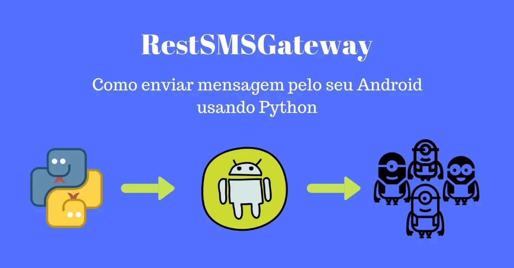
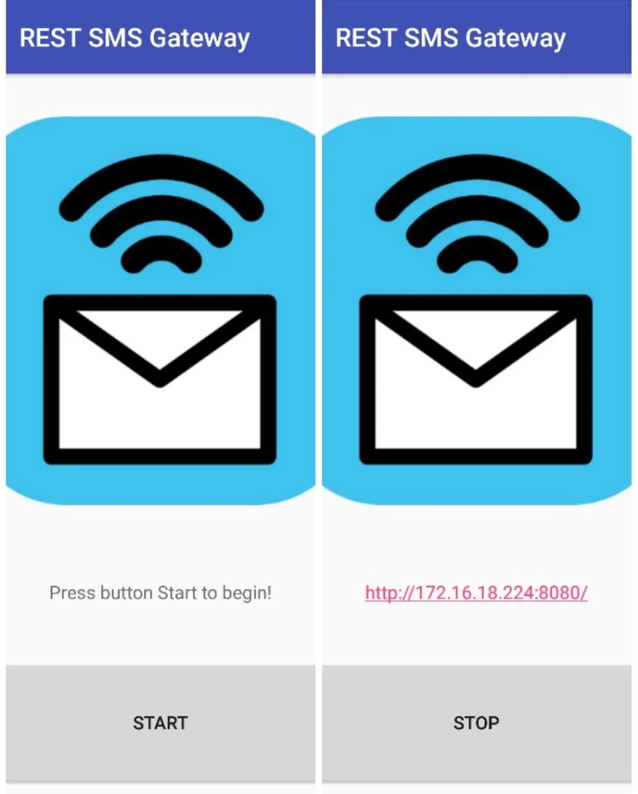
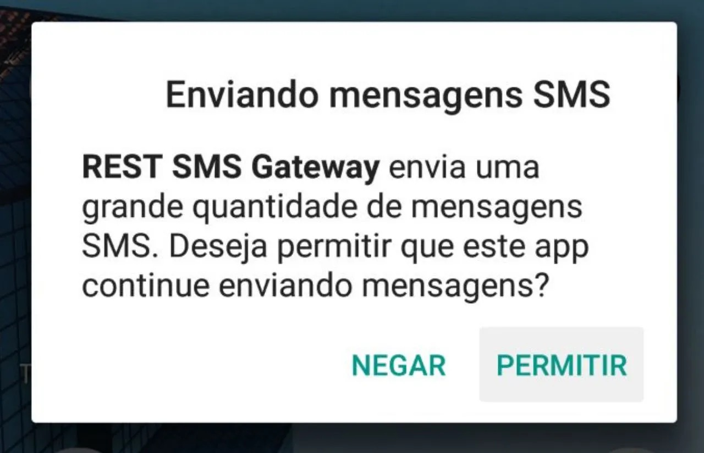

+++
date = '2023-04-20T19:04:18-03:00'
lastmod = '2023-04-20T19:04:18-03:00'
title = 'Rest SMS Gateway'
description = 'Como enviar mensagem pelo seu Android usando Python'
summary = 'Como enviar mensagem pelo seu Android usando Python'
author = 'Geraldo Castro'
tags = [
    'python',
    'sms',
    'android',
    'open source',
]
categories = []
slug = 'restsmsgateway'
aliases = [
    '/pt/restsmsgateway',
]
draft = true
# hiddenInHomeList = true
# hiddenPage = true

topAlerts = [
    # { type = 'tip', content = 'This is another alert box.' },
]
+++

> **note**
>  Esse conteudo foi primeiro publicado no Medium, em 01 de Março de 2019.
> 
> 📜 [RestSMSGateway: Como enviar mensagem pelo seu Android usando Python](https://medium.com/@exageraldo/restsmsgateway-como-enviar-sms-pelo-android-usando-python-227ddd3730ff)

> **warning**
>
> O aplicativo utilizado nesse tutorial, o _REST SMS Gateway_, foi remivodo da Google Play Store não muito tempo depois da publicação do pacote e da publicação. O [repositório do pacote](https://github.com/exageraldo/RestSMSGateway) ainda existe mas está em modo leitura.



Como tudo na vida há um porquê, primeiro vem a história (o problema) e depois o código (a solução, ou quase).

## Um natal <s>complicado</s> em familia

Era véspera de natal, as preparações para as festividades estavam batendo na porta e aquele famigerado “amigo” secreto estava para ser marcado, mas havia um problema: não teria como juntar todas as pessoas em um só lugar para retirar os papéis. Daí que eu tive a ideia de criar um script com as condições necessárias para o sorteio e enviar tudo por SMS, já que todos possuem celular. Comecei a procurar alguma plataforma viável para isso e encontrei algumas como [Magic SMS](https://www.magicsms.co.in/) e [Twilio](https://www.twilio.com/), mas não queria ter que contratar um serviço somente para essa finalidade, então decidi sair em busca de alguma alternativa aberta e gratuita e resultado: não achei nenhuma. Foi então que encontrei um aplicativo para Android, o [REST SMS Gateway](https://play.google.com/store/apps/details?id=com.perfness.smsgateway.rest&hl=pt_BR), e pude trabalhar em cima dela. Para resumir a história do amigo secreto, uma galera se desentendeu e decidiram por cancelar.

O REST SMS Geteway, como o nome mesmo já sugere, e é dito em sua descrição, ele transforma seu celular em um SMS gateway. Ele permite que você envie mensagens de texto pelo consumo de uma API Rest que ele cria no seu celular. _Vale lembrar que as tarifas utilizadas para o envio de cada mensagem é cobrada de acordo com sua operadora, como uma mensagem enviada diretamente do celular_.

Acabei por optar por esse aplicativo por um único motivo: ele roda localmente. Outros que achei no mesmo estilo precisavam de internet para funcionar, passando a mensagem para o servidor deles e só depois enviando a mensagem pelo celular, além de outras limitações para forçar você a se tornar membro premium/pro.

## REST SMS Geteway

*Tela inicial do Rest SMS Gateway*

Para iniciar o servidor, basta abrir o app no seu celular e apertar o botão START (e quando quiser parar, basta apertar em STOP). Aparecerá um link formado por um IP e uma porta (a porta é sempre a 8080). Ao clicar nela, será levado para a página de documentação da API. Não se surpreenda, a página é bem ruim e não traz todas as informações necessárias. É possível também ver alguns exemplos de códigos no final da página, tanto em Python (que não funcionam) como em Bash (não testado). E foi aqui que tudo começou. Comecei a enfrentar alguns problemas ao tentar consumir a API e não havia nenhuma informação na documentação e muito menos na internet.

No total são disponibilizadas 8 rotas (sendo três delas para a mesma coisa).


- [**GET**] /v1/thread/: Lista todas as conversas disponíveis no telefone.
- [**GET**] /v1/thread/<thread_id>/: Trás uma lista com algumas informações sobre as mensagens daquela conversa.
- [**GET**] /v1/sms/: Lista todas as mensagens.
- [**GET**] /v1/sms/<sms_id>/: Mostra as informações de uma mensagem específica.
- [**PUT**] /v1/sms/: Envia uma mensagem de texto.
- [**POST**] /v1/sms/: Envia uma mensagem de texto.
- [**GET**] /v1/sms/send/: Envia uma mensagem de texto (de novo? sim!)
- [**GET**] /v1/device/status/: Mostra algumas informações básicas do aparelho.

Não é possível encontrar na documentação informações sobre os retornos de cada roda (mal explica os dados necessários), sobre as limitações, muito menos sobre bugs. Ações básicas como pegar mensagens de um número específico ou de um certo intervalo de datas não são possíveis.

Buscando facilitar a minha vida e a de todos que queiram utilizar esse tipo de serviço, decidi criar uma biblioteca (super simples) para intermediar o consumo da API para o usuário.

A biblioteca leva o mesmo nome do aplicativo, só que sem espaços: [RestSMSGateway](https://github.com/exageraldo/RestSMSGateway). A ideia é simples: é fazer com que as pessoas se preocupem somente com o necessário para utilizar a API e adicionar funcionalidades não implementadas.

## Don’t copy, code!

Vamos começar do começo: instalando.

```sh
pip install rest-sms-gateway
```

Agora, inicie o aplicativo no seu celular (caso não tenha instalado ainda, [clique aqui](https://play.google.com/store/apps/details?id=com.perfness.smsgateway.rest&hl=pt_BR)) e aperte em START e pegue o endereço que está sendo mostrado lá.

```python
from rest_sms_gateway import SMSGatewayClient
client = SMSGatewayClient('http://your.link.here:8080')
```

Para todas as ações que iremos fazer daqui pra frente, será utilizando o `client`. Por exemplo, para ver se está tudo funcionando, podemos pegar as informações do aparelho:

```python
client.get_device_status()
```

```python
# Saida:
{
    "battery": {
        "level": 69.0,
        "status": "discharging"
    },
    "is_airplane_mode": False,
    "telephonies": [{
        "carrier_name": "Operadora",
        "display_name": "Operadora",
        "is_network_roaming": False,
        "network_operator_name": "Operadora",
        "sim_slot": 0,
        "sim_state": "ready"
    }],
    "telephony": {
        "is_network_roaming": False,
        "network_operator_name": "Operadora",
        "sim_state": "ready"
    },
    "timestamp": 1234567891011
}
```

Podemos considerar isso como o “hello world” da biblioteca. Caso esteja tudo certo com a conexão do computador com o celular, ele trará um dicionário com algumas informações do celular como, por exemplo, bateria, nome da operadora e se ele está em modo avião.

Vamos utilizar as funções básicas disponíveis pelo aplicativo via API. Primeiro vamos dar uma olhada nas conversas, também chamadas de threads. Podemos pegar as informações das conversas de duas maneiras:

```python
>>> client.get_thread()
```

```python
# OUTPUT
{
    "limit": "10",
    "offset": "0",
    "size": 10,
    "threads": [
        {
            "_id": "106",
            "count": "1",
            "timestamps": {"update": "1234567891011"}
        }, {
            "_id": "105",
            "count": "5",
            "timestamps": {"update": "1234567891011"}
        }, {
            "_id": "104",
             "count": "1",
             "timestamps": {"update": "1234567891011"}
        }, {
            "_id": "103",
            "count": "27",
            "timestamps": {"update": "1234567891011"}
        }, {
            "_id": "102",
            "count": "6",
            "timestamps": {"update": "1234567891011"}
        }, {
            "_id": "101",
            "count": "2",
            "timestamps": {"update": "1234567891011"}
        }, {
            "_id": "100",
            "count": "6",
            "timestamps": {"update": "1234567891011"}
        }, {
            "_id": "99",
            "count": "1",
            "timestamps": {"update": "1234567891011"}
        }, {
            "_id": "98",
            "count": "2",
            "timestamps": {"update": "1234567891011"}
        }, {
            "_id": "97",
            "count": "127",
            "timestamps": {"update": "1234567891011"}
        }
    ]
}
```

Quando chamado sem `thread_id`, o método `get_thread` retorna um dicionário com as seguintes informações:

- `limit`: O número limite de itens retornado na lista;
- `offset`: O número de itens a serem “ignorados” na lista;
- `size`: Número de itens retornado na lista (caso o número seja menor que o limite, mostrará um número inferior);
- `threads`: Lista contendo o id, quantidade e ultima atualização na conversa.

O `size` é padrão de todos os retornos e tanto o `limit` quanto o `offset` são parâmetros que todas as funções recebem. Isso serve para fazer paginação por exemplo.

```python
client.get_thread(limit=2)
```
```python
# OUTPUT
{
    "threads": [
        {
            "timestamps": {"update": "1234567891011"},
            "count": "1",
            "_id": "106"
        }, {
            "timestamps": {"update": "1234567891011"},
            "count": "5",
            "_id": "105"
        }
    ],
    "size": 2,
    "limit": "2",
    "offset": "0"
}
```

```python
client.get_thread(limit=2, offset=2)
``` 
```python
# OUTPUT
{
    "threads": [
        {
            "timestamps": {"update": "1234567891011"},
            "count": "1",
            "_id": "104"
        }, {
            "timestamps": {"update": "1234567891011"},
            "count": "27",
            "_id": "103"
        }
    ],
    "size": 2,
    "limit": "2",
    "offset": "2"
}
```

Perceba que o limite foi igual nas duas chamadas, porem, ao colocar o offset, ele ignorou as duas primeiras mensagens e mandou as duas seguintes. Esses parametros podem ser passados para qualquer método (porem ao chamar `get_sms` e passar o `sms_id` , apesar de sempre retornar uma lista com um único elemento, não fará diferença alguma). Por padrão o `limit` é 10 e o `offset` é zero.

```python
client.get_thread(thread_id=105)
```
```python
# OUTPUT
{
    "limit": "10",
    "messages": [
        {
            "_id": "1190",
            "msg_box": "inbox",
            "timestamps": {"delivery": "1234567891011"},
            "type": "sms"
        }, {
            "_id": "1189",
            "msg_box": "outbox",
            "timestamps": {"sent": "1234567891011"},
            "type": "sms"
        }, {
            "_id": "1188",
            "msg_box": "inbox",
            "timestamps": {"delivery": "1234567891011"},
            "type": "sms"
        }, {
            "_id": "1187",
            "msg_box": "inbox",
            "timestamps": {"delivery": "1234567891011"},
            "type": "sms"
        }, {
            "_id": "1186",
            "msg_box": "outbox",
            "timestamps": {"sent": "1234567891011"},
            "type": "sms"
        }
    ],
    "offset": "0",
    "size": "5"
}
```

Ao passar o `thread_id` para o método, ele traz um dicionário diferente. No lugar de `threads` , agora vem uma lista chamada `messages` , que mostra o id, o tipo da mensagem (MMS ou SMS), hora de envio (ou de entrega) e se foi uma mensagem enviada ou recebida (outbox ou inbox).

Perceba que em momento algum foi mostrado o conteúdo das mensagens e muito menos o número para qual foi enviado (ou recebido). Infelizmente não há nenhuma busca por número, ou uma forma de trazer todas as informações de uma só vez.

Agora é a vez de manipular as mensagens. Não muito diferente das conversas, basta chamar um método e enviar, ou não, o `sms_id` .

```python
client.get_sms(limit=3)
```

```python
# OUTPUT
{"limit": "3",
"messages": [{"_id": "1238",
              "address": "+5511987654321",
              "body": "Your message here! #1",
              "msg_box": "inbox",
              "thread_id": "57",
              "timestamps": {"delivery": "1234567891011"}},
             {"_id": "1237",
              "address": "+5511987654321",
              "body": "Your message here! #2",
              "msg_box": "inbox",
              "thread_id": "57",
              "timestamps": {"delivery": "1234567891011"}},
             {"_id": "1236",
              "address": "+5511234567890",
              "body": "Your message here! #3",
              "msg_box": "inbox",
              "thread_id": "106",
              "timestamps": {"delivery": "1234567891011"}}],
"offset": "0",
"size": "3"}
```
```python
client.get_sms(sms_id=1238)
```

```python
{"sms": [{
    "_id": "1238",
    "address": "+5511987654321",
    "body": "Your message here! #1",
    "msg_box": "inbox",
    "thread_id": "57",
    "timestamps": {"delivery": "1234567891011"}
}]}
```

Finalmente apareceu o número da pessoa! Somente pegando pelas mensagens é que o `address` é mostrado. Como já mostrado em outros retornos, a mensagem vem com id, message box (inbox ou outbox), a data e as novidades são: corpo da mensagem e número.

At last but not least, vamos enviar as mensagens!

Como todos os comandos mostrados são o mais simples possiveis, esse não poderia ser diferente:

```python
sender = client.send_sms('+5511987654321', 'Your first message')
if sender['ok']: # or sender['status_code'] == 200
    print('Message sent!')
```

Sim, é simples assim. O primeiro parametro é o número para o qual você quer enviar a mensagem e o segundo já é a mensagem. Para enviar mensagem para mais de uma pessoa, pode-se fazer da seguinte maneira:

```python
friends_numbers = ['+5511987654321', '+5511987654322', '+5511987654323']
for friend in friends_numbers: # Bulk SMS 
    client.send_sms(friend, "Hey, let's play BroForce!")
```

Na mesma ideia, para enviarmos para a mesma pessoa, várias vezes:

```python
for msg_count in range(60):
    client.send_sms('+5511987654321', "I'm a spammer!")
```

Assim, o script enviará 60 mensagens para o número informado. Mas isso irá gerar um problema no seu celular. Depois de enviar 30 mensagens (pelo menos nos casos testados) irá aparecer uma notificação mais ou menos assim no seu celular:


*Notificação ao tentar enviar muitas mensagens*

Não seria um problema muito grande caso ela aparecesse somente uma vez e enviasse o restante das mensagens, mas não funciona bem assim. Depois do envio das 30 mensagens, as que vierem depois precisarão da sua confirmação para serem enviadas. Por exemplo, quando você envia 60 mensagens, as 30 primeiras vão sem problema algum (teoricamente) mas você terá que autorizar as outras 30, uma por uma, apertando em “**PERMITIR**” na notificação.

Pensando em solucionar essas limitações, tanto da API quanto do Android, eu criei algumas classes com outras manipulações. Foram elas:

- **Conversation**: Uma classe para manipular as threads . Há como pegar os ids de todas as conversas, procurar uma conversa pelo número de telefone, além das manipulações básicas mostradas anteriormente.
- **Message**: Uma classe para manipular as sms . Há como pegar os ids de todas as mensagens, enviar mensagem em massa (de modo seguro ou não), além das manipulações básicas mostradas anteriormente.

```python
from rest_sms_gateway import Conversation, Message
conv = Conversation('http://your.link.here:8080')
conv.get_by_number('5511987654321')
```
```python
# OUTPUT
{
    "limit": "100000",
    "messages": [
        {
            "_id": "1190",
            "msg_box": "inbox",
            "timestamps": {"delivery": "1234567891011"},
            "type": "sms"
        }, {
            "_id": "1189",
            "msg_box": "outbox",
            "timestamps": {"sent": "1234567891011"},
            "type": "sms"
        }, {
            "_id": "1188",
            "msg_box": "inbox",
            "timestamps": {"delivery": "1234567891011"},
            "type": "sms"
        }, {
            "_id": "1187",
            "msg_box": "inbox",
            "timestamps": {"delivery": "1234567891011"},
            "type": "sms"
        }, {
            "_id": "1186",
            "msg_box": "outbox",
            "timestamps": {"sent": "1234567891011"},
            "type": "sms"
        }
    ],
    "offset": "0",
    "phone": "5511987654321",
    "size": "5"
}
```
```python
msgs = Message('http://your.link.here:8080')
contact_list = ['+5511987654321', '+5511987654322', '+5511987654323']
msg_body = 'Hello there!'
msg.bulk_msg( 
    message=msg_body,
    address_list=contact_list,
    amount=1,
    safe_mode=True
)

# OUTPUT
# All messages to +5511987654321 have been sent
# All messages to +5511987654322 have been sent
```

A biblioteca ainda se encontra em desenvolvimento, tendo que finalizar melhor a parte da documentação das classes complementares (Message e Conversation), escrever um README com maiores detalhes e **criar testes**!

## Observações Importantes

- É uma biblioteca não oficial;
- A versão que estou usando para esse tutorial é a 0.5.0;
- O celular precisa estar conectado em alguma rede para que outros dispositivos possam usar do seu serviço;
- O código está desenvolvido em Python 3.6;
- Todas as informações necessárias das rotas que estão disponíveis na documentação da API, também está na documentação do código;
- Há limitações que ocorrem por conta do sistema Android, [como esse aqui](https://forums.androidcentral.com/google-nexus-4/227096-messaging-sending-large-amount-messages.html), que teoricamente estão sendo tradados, mas são passivos de falhas.

## Próximos passos

Essa foi a primeira vez que eu fiz uma biblioteca python, então é possível que tenha algumas melhorias a fazer e alguns (ou mais que alguns) bugs.

Uma pretensão que eu tenho é de criar um aplicativo com a mesma ideia que o Rest SMS Gateway, porem completo e aberto. Não tenho muita experiência com Android nativo, e nunca procurei para ver se outras tecnologias, como React Native por exemplo, poderiam fazer a mesma coisa.

Enquanto isso, vou adicionando novas funcionalidades (e bugs talvez) e aceitando Pull Requests para melhorias da biblioteca.

Obrigado! 💙💛